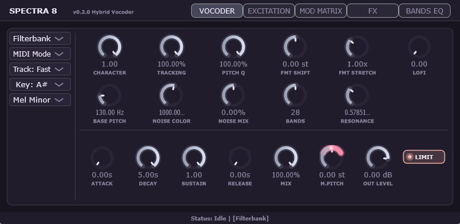
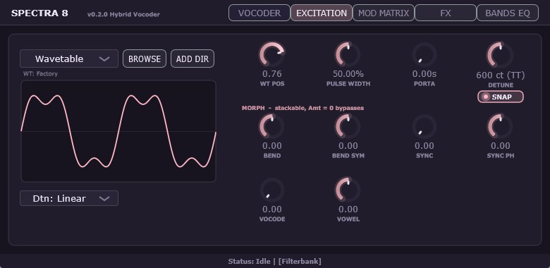
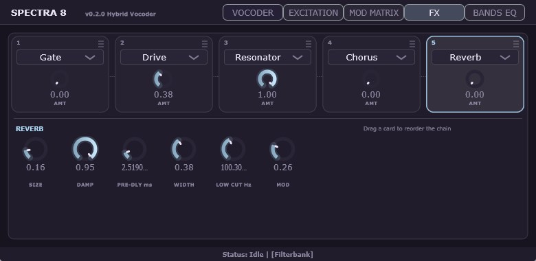

# SPECTRA 8


##


## Overview

**SPECTRA 8** is a hybrid vocoder VST3 plugin that combines two completely different voice-modeling engines in a single instrument:

* **Filterbank Vocoder** — a classic 8–48 band analysis/synthesis vocoder with per-band level tracking. Crisp, articulate, and immediate.
* **LPC Vocoder** — a linear-predictive vocal-tract model with reflection-coefficient lattice synthesis. This is the architecture behind speech chips like the TMS5220, and it delivers everything from natural formant morphing to unapologetically retro robot speech.

Both engines share the same carrier (excitation) section, a 56-destination modulation matrix, an interactive 48-band EQ, and an expanded 5-slot FX chain ported directly from COLORS (featuring a 50-pattern Formant Gate and a MIDI-tracking Spectral Resonator). You can crossfade between engines without dropouts, freely resize the UI, and choose from 150 factory presets spanning 8 dedicated categories.

**Design goal:** surpass Orange Vocoder in sound quality while absorbing the retro character of BitSpeek — in one versatile, highly-playable instrument.


## Key Features

### Dual Vocoder Engines

* **Filterbank mode:** Mel-spaced band layout across 80–7500 Hz that re-spans to whatever band count you choose (8–48), so reducing bands widens each filter instead of leaving the top of the spectrum uncovered. Band Q is derived from the spacing, with a RESONANCE control to scale it.
* **LPC mode:** Selectable order (8/10/12/16), analysis frame rate (8–80 Hz), window type (Hann/Hamming/Blackman), reflection-coefficient quantization (Off/6/5/4/3 bit), and three interpolation domains (Step / LSP / LAR).
* **30 ms equal-power crossfade** when switching engines — no clicks, no gaps.

### Formant Control

* **FMT SHIFT** (±24 st): shifts formants by resampling the analysis window (tape-varispeed method). Pitch is unaffected.
* **FMT STRETCH** (0.5–2.0×): expands or compresses formant spacing. In LPC mode this uses VTLN all-pass warping with progressive bandwidth expansion, guaranteeing the filter peak never exceeds the original by more than 12 dB — the earlier LSF-warping implementation could push poles into the clamp boundary and explode by +30 dB.
* **FREEZE:** holds the current vocal tract shape indefinitely.

### Pitch & Scale

* **PITCH TRACKING** with an MPM-based tracker (zero-crossing-constrained peak picking, evidence-based octave correction, 3-frame median). Track response is selectable: Fast / Natural / Smooth.
* **PITCH Q** — scale-quantized auto-tune with 0.3-semitone hysteresis so it never chatters at note boundaries.
* **M.PITCH** (±24 st) — master transposition applied *before* scale snapping. With PITCH Q at 100%, modulating M.PITCH with an LFO walks the sound through the selected key and scale. Works in both Auto and MIDI modes.
* **20 scales:** Chromatic, Major, Minor, Maj/Min Pentatonic, Harmonic Minor, Melodic Minor, Dorian, Phrygian, Lydian, Mixolydian, Locrian, Blues, Whole Tone, Diminished (H-W), Hungarian Minor, Hirajoshi, Insen, Iwato, Hijaz.

---

##


### Excitation (Carrier) Engine

The carrier is an 8-voice polyphonic oscillator with PolyBLEP anti-aliasing.

* **Waveforms:** Sawtooth / Pulse (variable width) / Wavetable.
* **Custom wavetables:** load any WAV/AIFF (Serum-compatible 2048 samples per frame, up to 64 frames). The two-pane browser shows sub-folders on the left and waveforms on the right — click to load and audition instantly. **RANDOM** picks one at random from your whole library. The registered folder is stored globally, so it survives DAW restarts and follows you into new projects.
* **Morph (3 types, freely combinable):** BEND (phase bending), SYNC (hard-sync-style phase repetition), VOCODE (A-I-U-E-O formant filtering). Each has its own Amount and Shift knob, all three can run at once (applied Bend → Sync → Vocode), and any knob at 0 bypasses that stage. The waveform display reflects all of them in real time, including the Vocode filtering.
* **Detune modes:** Classic / Linear / Exp / Drift (analog-style random walk) / Chorus (per-voice LFO). Cent values are shown with interval names (e.g. `700 ct (P5)`), and SNAP quantizes dragging to semitones.
* **NOISE ±** (BitSpeek-style bipolar): in LPC mode, negative values strip unvoiced noise, 0 follows the input's own voiced/unvoiced ratio, and positive values force noise excitation. NOISE COLOR tunes its band-pass center.
* **LO-FI:** bit reduction plus pitch-synchronized sample & hold — the hold rate tracks the fundamental, so the sound gets coarse without dropping in pitch.

---

##


### Modulation Matrix

* **Sources:** LFO × 3 (Sine/Tri/Saw/Square/S&H/Chaos, free or tempo-synced across 13 divisions), ENV × 2 (loopable ADSR), Velocity, Note, Mod Wheel, Random.
* **6 slots**, each with Source → Destination, bipolar Amount, and a Uni/Bipolar polarity switch.
* **56 destinations** — every knob across the VOCODER, EXCITATION, and FX tabs (including Resonator Shift/Spread/OutGain, Gate Decay, Drive, Chorus, and Reverb).
* **Live range display:** modulated destination knobs persistently render a pink arc band showing the reachable modulation range plus a bright dot for the instantaneous modulated value. Real-time preview is active even when idling without incoming audio. The band is computed through the exact same mathematical function the DSP uses, ensuring perfect visual-to-audio fidelity.
* Logarithmic parameters (BASE PITCH, NOISE COLOR, RESONANCE, Attack/Decay/Release) are modulated as octave ratios rather than linear offsets, keeping them musically usable across their entire range.

---

##


### FX Chain

Five slots in series, ported and expanded directly from **COLORS** with full MIDI-mode integration. Drag any card to reorder the chain; click a card to edit its parameters in the Detail area below.

* **SPECTRAL RESONATOR** — 8 tuned comb resonators with Karplus-Strong topology and complete MIDI tracking.
  * **CHORD mode:** place the resonators on a root note and chord type (Octaves / Power 5 / Major / Minor / Sus4 / Min7 / Maj9 / Dim).
  * **MIDI mode:** resonator pitches dynamically follow the MIDI notes played. Fewer than 8 notes are stacked into upper octaves. Releasing keys holds the last voicing without cutting off.
  * **SHIFT (±24 st):** semitone pitch transposition knob — modifiable in real time via the ModMatrix for arpeggiated resonator chords and pitch bends.
  * **SPREAD (0–100%):** stereo pan distribution across the 8 resonator lines.
  * **OUT GAIN (-12–+12 dB):** output level compensation.
  * **DECAY (0.05–20 s):** pitch-compensated ring-out time in seconds, ensuring equal sustained resonance from low sub-bass up to high treble.
  * **SHIMMER (0–100%):** adds octave-up and two-octave-up sparkle exclusively in parallel to the output without destabilizing the feedback loop.
  * **INHARM (0–100%):** partial-frequency stretching (`f_n /= √(1+B·n²)`), producing authentic metallic bells and gamelan-like clangs.
* **MULTIBAND DRIVE** — 3-band split (300 Hz / 2500 Hz) with independent band gains and drive amount. Shapes: Tanh / Fold / Crush.
* **FORMANT GATE** — 16-step tempo-synced rhythm slicer ported from COLORS.
  * **50 PATTERNS:** comprehensive rhythm library including classic trance gates, triplets, dotted polyrhythms, stutter glitches, swing funk cuts, and complex chisel patterns.
  * **GATE DECAY (5–1000 ms):** continuous envelope release control, ranging from sharp micro-plucks to smooth breathing swells.
  * **VOWEL (0–100%):** per-step vowel formant filter modulation.
* **ENSEMBLE CHORUS** — 4-voice widener with Rate, Depth, and Width.
* **REVERB** — comb/allpass reverb with Size, Pre-Delay (0–200 ms), Width (M/S), Low Cut, Damp, and delay-modulation jitter.

---

##


### Bands EQ & Analyzer

* **Draggable band EQ:** drag directly on the graph to shape the response. In Filterbank mode this scales each vocoder band; in LPC mode it is applied as a peaking-filter cascade after synthesis. Band center frequencies follow the active band count, so the graph and the actual filters always agree.
* **High-precision analyzer:** a 320-band constant-Q filterbank with envelope followers — not an FFT. Time and frequency resolution are optimized per band, giving a smooth low end and fast high-end response. Multirate processing (bands below 2 kHz run at 1/4 rate behind an 8th-order Butterworth anti-alias filter) keeps the CPU cost down. It runs on a background thread and displays the plugin's final output, colored with a low-to-high frequency gradient.
* Double-click a band to reset it to 0 dB; right-click for a confirmation bar to reset every band.


## Parameter Reference

### VOCODER

| Parameter | Range | Default | Description |
|---|---|---|---|
| CHARACTER | 0.0 – 1.0 | 1.0 | Filterbank: band envelope sharpness / LPC: bandwidth expansion γ |
| TRACKING | 0 – 100 % | 0 % | How much the carrier follows the detected input pitch |
| PITCH Q | 0 – 100 % | 0 % | Scale-quantization amount (auto-tune) |
| FMT SHIFT | -24 – +24 st | 0 st | Formant shift (pitch unaffected) |
| FMT STRETCH | 0.5 – 2.0× | 1.0× | Formant spacing expansion / compression |
| LOFI | 0.0 – 1.0 | 0.0 | Bit reduction + pitch-synced sample & hold |
| BASE PITCH | 50 – 500 Hz | 130 Hz | Carrier pitch when TRACKING is 0 |
| NOISE COLOR | 100 – 10 kHz | 1 kHz | Noise band-pass center |
| NOISE MIX | -100 – +100 % | 0 % | Bipolar voiced/unvoiced control |
| BANDS | 8 – 48 | 48 | Filterbank band count |
| RESONANCE | 0.3 – 3.0× | 1.0× | Band Q scale (Filterbank only) |
| ATTACK / DECAY | 0.001 – 5.0 s | 0.01 / 0.1 s | Carrier ADSR (MIDI mode) |
| SUSTAIN | 0.0 – 1.0 | 0.8 | Carrier ADSR |
| RELEASE | 0.001 – 5.0 s | 0.2 s | Carrier ADSR |
| MIX | 0 – 100 % | 100 % | Dry ⇔ (Vocoder + FX). At 0 the FX chain is fully bypassed |
| M.PITCH | -24 – +24 st | 0 st | Master transposition, applied before scale snapping |
| OUT LEVEL | -60 – +12 dB | 0 dB | Master output level |

### LPC Mode (additional)

| Parameter | Options | Default | Description |
|---|---|---|---|
| ORDER | 8 / 10 / 12 / 16 | 16 | Vocal tract model order. Lower = coarser and louder |
| WINDOW | Hann / Hamming / Blackman | Hann | Analysis window |
| FRAME RATE | 8 / 15 / 25 / 50 / 80 Hz | 50 Hz | Analysis update rate. Lower = choppy, toy-like |
| K QUANT | Off / 6 / 5 / 4 / 3 bit | Off | Reflection-coefficient quantization (retro roughness) |
| INTERP | Step / LSP / LAR | Step | Frame interpolation domain |
| FREEZE | Off / On | Off | Hold the current vocal tract shape |

### EXCITATION

| Parameter | Range | Default | Description |
|---|---|---|---|
| WT POS | 0.0 – 1.0 | 0.0 | Wavetable frame morph position |
| PULSE WIDTH | 5 – 95 % | 50 % | Pulse duty cycle |
| PORTA | 0.0 – 2.0 s | 0.1 s | Portamento time |
| DETUNE | 0 – 1200 ct | 5 ct | Unison detune, shown with interval names |
| BEND / BEND SYM | -1.0 – +1.0 | 0.0 | Morph: phase bend amount / symmetry point |
| SYNC / SYNC PH | 0.0–1.0 / ±1.0 | 0.0 | Morph: hard-sync ratio (1–8×) / phase offset |
| VOCODE / VOWEL | 0.0–1.0 / ±1.0 | 0.0 | Morph: formant filter amount / A-I-U-E-O position |

### FX

| FX | Parameters |
|---|---|
| **Resonator** | MODE (Chord/Free/MIDI), CHORD, ROOT (C1–C7), SHIFT (-24–+24 st), DECAY (0.05–20 s), DAMP, SPREAD, OUT GAIN (-12–+12 dB), SHIMMER, INHARM |
| **Drive** | SHAPE (Tanh/Fold/Crush), DRIVE (1–40×), LOW, MID, HIGH |
| **Gate** | RATE (1/2–1/32, tempo-synced), PATTERN (50 types: Trance, Triplet, Polyrhythm, Stutter, Glitch, etc.), GATE DECAY (5–1000 ms), VOWEL, SMOOTH |
| **Chorus** | RATE (0.02–8 Hz), DEPTH (0.1–12 ms), WIDTH |
| **Reverb** | SIZE, DAMP, PRE-DLY (0–200 ms), WIDTH, LOW CUT (20–1000 Hz), MOD |


## Signal Flow

```
Input (Stereo)
    │
    ├──────────────────────────────────────────────► [Dry] ──┐
    │                                                         │
    ▼ (down-sample to 16 kHz)                                 │
[Pitch Tracker] ──► [M.PITCH → PITCH Q scale snap]            │
    │                                                         │
    │   [Excitation Engine: 8 voices]                         │
    │        Saw / Pulse / Wavetable                          │
    │        Morph: Bend → Sync → Vocode                      │
    │        Detune / Noise / LoFi                            │
    │              │                                          │
    ▼              ▼                                          │
┌──────────────────────────────┐                              │
│  Filterbank Vocoder  ──┐     │                              │
│   (mel 8–48 bands)     ├─ 30 ms equal-power crossfade       │
│  LPC Vocoder ──────────┘     │                              │
│   (order 8–16, lattice)      │                              │
│   └─► Post Band EQ           │                              │
└──────────────────────────────┘                              │
    │ (up-sample to host rate)                                │
    ▼                                                         │
[FX Chain: 5 slots, drag to reorder]                          │
    Resonator / Drive / Gate / Chorus / Reverb                │
    │                                                         │
    ▼                                                         ▼
    └──────────────► [MIX crossfade] ◄────────────────────────┘
                            │
                     [OUT LEVEL]
                            │
                     [Brick-wall Limiter]
                            │
                     Final Output (Stereo)
```

The FX chain sits on the wet path, so **MIX at 0 gives you the untouched dry signal** with the vocoder and every effect fully bypassed.


## Real-Time Safety

* **Zero heap allocation on the audio thread.** All buffers are pre-allocated in `prepareToPlay()` — no `new`, `resize()`, or `push_back()` in `processBlock()`.
* **Lock-free analyzer.** The spectrum analyzer runs on a background thread and communicates only through atomics and a ring buffer.
* **Smoothed parameters.** MIX and OUT LEVEL use 20 ms sample-accurate ramps. FMT SHIFT/STRETCH, DETUNE, NOISE, and resonator delay lengths are smoothed inside their engines to prevent zipper noise and clicks.
* **Bounded feedback.** Resonator feedback is hard-limited below 1.0 with soft clipping inside the loop; reverb feedback tops out at 0.98.
## UI Scaling & Ergonomics

* **Freely resizable window:** Drag from any corner or edge to scale the entire interface from 25% up to 200%. The UI maintains a crisp, fixed aspect ratio (1100 × 700 base resolution) with vectorized graphics.
* **Persistent window size:** The plugin automatically remembers your preferred editor dimensions across DAW sessions and project reloads.


## Factory Presets (150 Presets)

SPECTRA 8 includes **150 production-ready factory presets** organized into 8 distinct musical categories:

1. **FilterBank (Auto)** — 20 presets: Natural articulation, pop harmonies, deep vocoded textures, and sub tracking.
2. **LPC (Auto)** — 20 presets: Retro 8-bit robots, speech chips, vintage toys, and synthetic whisper pads.
3. **FilterBank (MIDI)** — 20 presets: Polyphonic playable chords, EDM chops, and sharp vocal lead synths.
4. **LPC (MIDI)** — 20 presets: Expressive vocal-tract solo leads, talking basses, and formantic polysynths.
5. **M.Pitch Modulations** — 10 presets: Slow analog flutter, 16th-note sync arps, and pentatonic scale snap sequences.
6. **Rhythmic Formant Gate** — 10 presets: 50-pattern groove gates, 32nd stutter glitches, and breathing envelope decays.
7. **Spectral Resonator Lab** — 10 presets: Micro-delay combs, +24 st shifted arpeggios, and 85% inharmonic metallic bell clouds.
8. **SpecialFX** — 40 presets: Full 6-slot modulation matrix powerhouses across FilterBank (20) and LPC (20) engines in complete MIDI mode, covering cybernetic uplinks, quantum singularities, hologram glitches, and bio-scanners.


## 📚 Manual

Quick manuals covering every tab and parameter, plus starting-point settings and troubleshooting:

[  ](Source/Assets/SPECTRA8_Manual_EN.md)
[  ](Source/Assets/SPECTRA8_Manual_JP.md)


## Installation

1. Download `SPECTRA8.vst3` from the Releases page.
2. Copy it to your VST3 directory:
   ```
   C:\Program Files\Common Files\VST3\
   ```
3. Rescan plugins in your DAW.

### Build Requirements

* **JUCE** 8.0.x — place at `C:/JUCE` or update `JUCE_PATH` in `CMakeLists.txt`
* **CMake** 3.22 or higher
* **Visual Studio** 2022 (MSVC, C++17)

```bash
cmake -B build -DJUCE_PATH=C:/JUCE
cmake --build build --config Release
```


## System Requirements

* **OS:** Windows 10 / 11 (64-bit)
* **Format:** VST3 / Standalone
* **Tested Host:** Ableton Live 11 / 12

> ⚠️ **Compatibility Notice:** Verified operation is confirmed in **Ableton Live**. Other DAWs may work but are currently unverified.


## Tips

* **Classic vocoder:** Filterbank mode, BANDS 32–48, TRACKING 0%, Saw carrier. Set BASE PITCH to the key of your track.
* **Robot speech (BitSpeek style):** LPC mode, ORDER 8–10, FRAME RATE 8–15 Hz, K QUANT 3–4 bit.
* **Auto-tuned vocal:** TRACKING 100%, PITCH Q 100%, then pick a Key and Scale.
* **Scale-locked melodic movement:** PITCH Q 100%, then assign an LFO (Saw or S&H) to M.PITCH in the MOD MATRIX. The output walks the scale.
* **Color Bass:** FX slot 1 = Resonator (CHORD, Minor), slot 2 = Drive. Add SHIMMER around 0.4 and INHARM around 0.2 for sparkle.
* **EDM vocal chop:** FX Gate with RATE 1/16, SHAPE 0.5, and VOWEL up around 0.6.


## Disclaimer

**Please read before use.**

SPECTRA 8 is a vocoder with resonant filter banks, an all-pole LPC synthesis lattice, feedback-based effects (Resonator, Reverb, Chorus), and a modulation matrix that can drive any of them. Certain combinations of settings — high RESONANCE, low LPC ORDER with high CHARACTER, long Resonator DECAY, large Reverb SIZE, or modulation applied to those controls — can produce sudden, extremely loud output.

* **Always keep a limiter in the signal path.** SPECTRA 8's output stage runs a brick-wall limiter with a fixed ceiling of −0.1 dBFS, and the **LIMIT** button defaults to on. Do not switch it off unless you have another limiter after it. Placing an additional limiter on your master bus is strongly recommended.
* **Start at low monitoring levels**, especially when using headphones, when auditioning unfamiliar presets, or when experimenting with the modulation matrix.
* **Take particular care with FREEZE and with the Resonator.** Freezing the vocal tract model while feeding it a sustained carrier, or driving the Resonator with a long DECAY, can build up energy over several seconds rather than instantly — the level may keep rising after you stop touching the controls.
* **Protect your hearing and your equipment.** Sudden loud output can cause permanent hearing damage and can damage speakers, headphones, and other audio equipment.

THIS SOFTWARE IS PROVIDED "AS IS", WITHOUT WARRANTY OF ANY KIND, EXPRESS OR IMPLIED, INCLUDING BUT NOT LIMITED TO THE WARRANTIES OF MERCHANTABILITY, FITNESS FOR A PARTICULAR PURPOSE AND NONINFRINGEMENT. IN NO EVENT SHALL THE AUTHOR BE LIABLE FOR ANY CLAIM, DAMAGES OR OTHER LIABILITY — INCLUDING BUT NOT LIMITED TO HEARING DAMAGE, DAMAGE TO AUDIO EQUIPMENT, DATA LOSS, OR LOST WORK — WHETHER IN AN ACTION OF CONTRACT, TORT OR OTHERWISE, ARISING FROM, OUT OF OR IN CONNECTION WITH THE SOFTWARE OR THE USE OR OTHER DEALINGS IN THE SOFTWARE.

**You use this software entirely at your own risk.**


## License

This project is licensed under the GNU Affero General Public License v3.0 (AGPLv3) — see [LICENSE](LICENSE) for details.

This software is built with the **JUCE 8** framework. In accordance with JUCE 8's open-source licensing terms, this entire project is distributed under the AGPLv3.


## Credits

**Developer:** @kijyoumusic (OTODESK)

**Framework:** JUCE 8.0.x

**Target DAW:** Ableton Live 11 / 12

**DSP References:**
- Markel & Gray — *"Linear Prediction of Speech"* (1976)
- Itakura — *"Line Spectrum Representation of Linear Predictive Coefficients"* (1975)
- McLeod & Wyvill — *"A Smarter Way to Find Pitch"* (MPM, 2005)
- Karplus & Strong — *"Digital Synthesis of Plucked-String and Drum Timbres"* (1983)
- Välimäki & Huovilainen — *"Antialiasing Oscillators in Subtractive Synthesis"* (PolyBLEP, 2007)


## Support

* **Social / Demo:** [@kijyoumusic](https://x.com/kijyoumusic)
* [](https://otodesk4193.github.io/OTODESK_SITE/)
